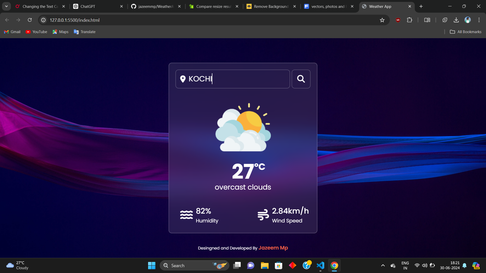

# Weather App

A simple weather web application that fetches weather data using the OpenWeather API and displays it to the user.

## Features

- **Current Weather Display**: Shows the current weather conditions including temperature, humidity, and wind speed.
- **Search Functionality**: Allows users to search for weather information of different cities.
- **Responsive Design**: Designed to work well on desktop and mobile devices.

## Technologies Used

- HTML
- CSS
- JavaScript (Vanilla JS)
- OpenWeather API

## APIs Used

- [OpenWeather API](https://openweathermap.org/api)

## Setup Instructions

1. **Clone the repository:**
   ```bash
   git clone <repository_URL>
   cd weather-app
   ```

2. **Get API Key:**
   - Sign up for a free account on [OpenWeather](https://home.openweathermap.org/users/sign_up).
   - Obtain an API key from OpenWeather.

3. **Configure API Key:**
   - Create a `config.js` file in the root directory.
   - Add your API key in `config.js`:
     ```javascript
     const API_KEY = 'your_api_key_here';
     ```

4. **Run the Application:**
   - Open `index.html` in your browser.

## How to Use

- Enter a city name in the search input and press Enter or click the search button.
- The current weather information for the entered city will be displayed.

## Example



## Credits

- **OpenWeather**: For providing weather data API.

## License

This project is licensed under the MIT License - see the [LICENSE](LICENSE) file for details.

---

### Notes:

- Replace `<repository_URL>` with your actual GitHub repository URL.
- Ensure your `config.js` file is included in your `.gitignore` to avoid exposing your API key publicly.
- Customize the `Example` section with a screenshot from your project.

Feel free to customize this template further based on additional features or specific details of your weather app project.